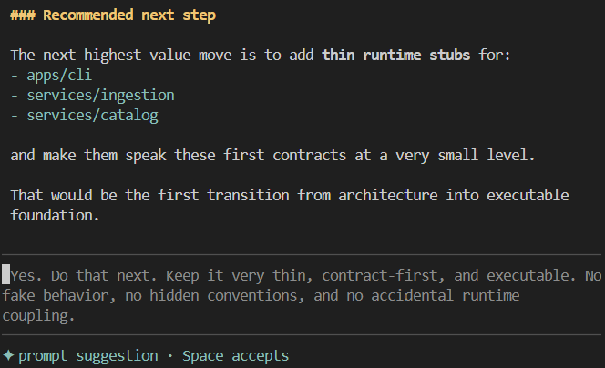

# pi-prompt-suggester

[npm package](https://www.npmjs.com/package/@guwidoe/pi-prompt-suggester)

`pi-prompt-suggester` suggests the user's likely next prompt after each assistant completion.

It uses recent conversation context plus a lightweight project intent seed so suggestions stay aligned with what the user has been doing in the current repo.



## Highlights

- next-prompt suggestions as ghost text in the editor
- repo-aware suggestions grounded in project intent
- persistent custom instruction you can edit in the TUI
- project- or user-scoped behavior overrides

## Install

### Install from npm

Global install:

```bash
pi install npm:@guwidoe/pi-prompt-suggester
```

Project-local install:

```bash
pi install -l npm:@guwidoe/pi-prompt-suggester
```

Pin a version if needed:

```bash
pi install npm:@guwidoe/pi-prompt-suggester@0.1.30
```

After install, restart `pi` or run `/reload`.

### Manual settings.json entry

Add to `packages` in `~/.pi/agent/settings.json` or `.pi/settings.json`:

```json
{
  "packages": [
    "npm:@guwidoe/pi-prompt-suggester"
  ]
}
```

## Usage

### Main entrypoint

Use:

- `/suggesterSettings`

This is the main UI for normal users. It lets you:
- edit the custom instruction
- choose custom suggester/seeder models
- choose custom suggester/seeder thinking levels
- customize the maximum suggested-prompt length
- tune common behavior settings
- reset overrides

### Everyday behavior

- after an assistant completion, the extension may suggest the next user prompt
- when the editor is empty and the suggestion is compatible, it appears as ghost text
- press `Space` on an empty editor to accept the full suggestion

### Common commands

- `/suggesterSettings` — main settings UI
- `/suggester` or `/suggester status` — inspect current status
- `/suggester reseed` — refresh project intent in the background

### Advanced commands

Most users do not need these, but they are available:

- `/suggester instruction ...`
- `/suggester model ...`
- `/suggester thinking ...`
- `/suggester config ...`
- `/suggester seed-trace ...`

## Configuration

The most useful settings are the custom instruction, custom suggester/seeder models, custom suggester/seeder thinking levels, and the maximum suggested-prompt length.

You can edit them via:
- `/suggesterSettings`

Or:
- `/suggester instruction set [project|user]`
- `/suggester model ...`
- `/suggester thinking ...`
- `/suggester config set suggestion.maxSuggestionChars <number>`

Overrides can be stored at:
- user: `~/.pi/suggester/config.json`
- project: `.pi/suggester/config.json`

If you want the full config surface, see:
- [`config/prompt-suggester.config.json`](./config/prompt-suggester.config.json)

## Docs

For implementation details, architecture, and maintainer-oriented notes, see:

- [`docs/architecture.md`](./docs/architecture.md)
- [`docs/architecture-decisions.md`](./docs/architecture-decisions.md)
- [`docs/meta-prompts.md`](./docs/meta-prompts.md)
- [`docs/roadmap.md`](./docs/roadmap.md)
